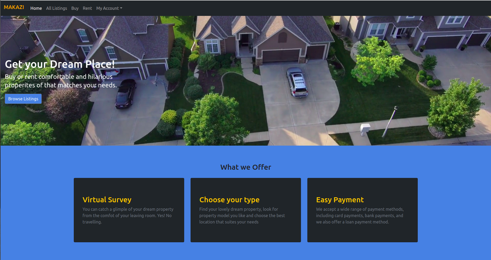
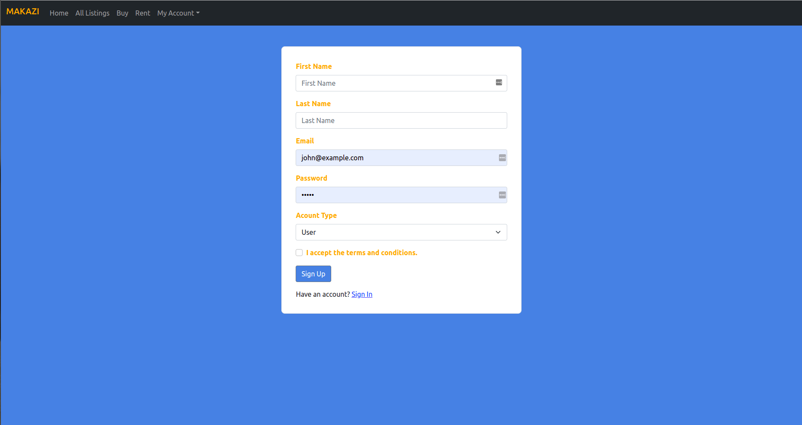
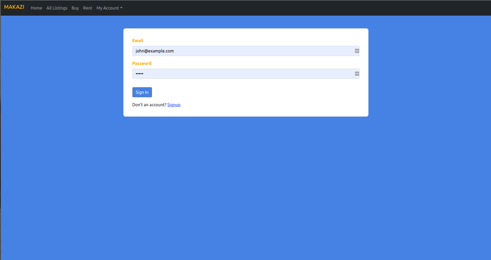
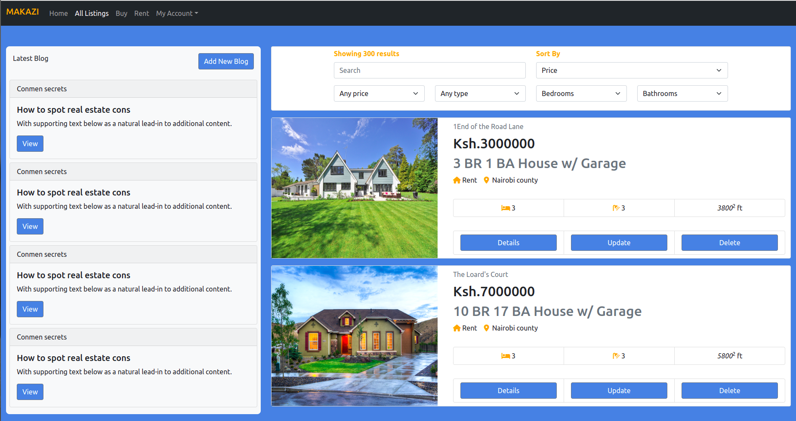
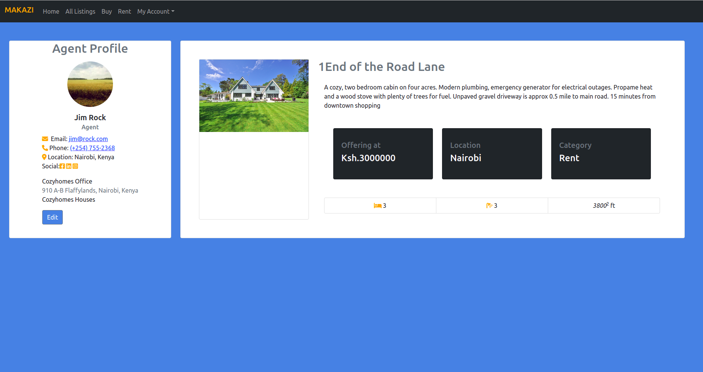
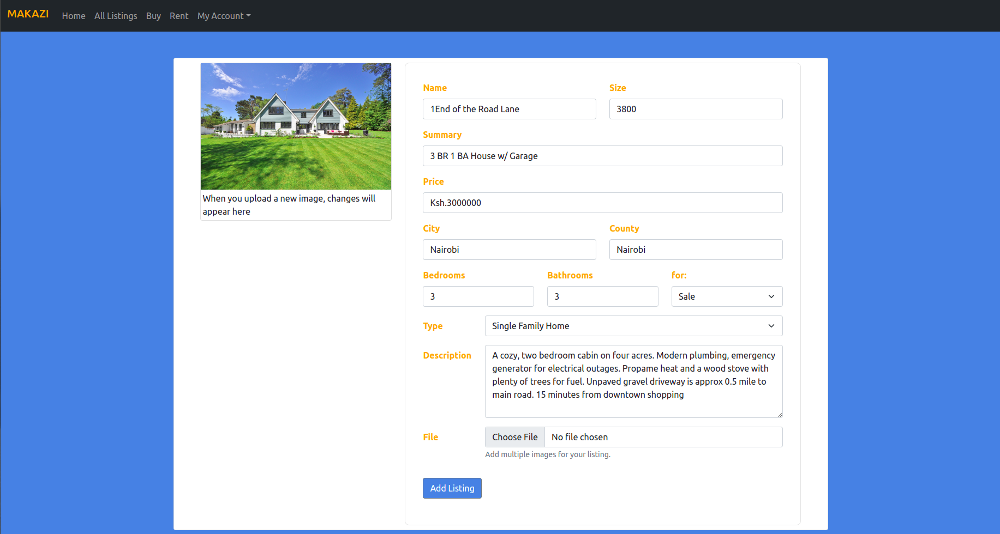

# Makazi

Makazi is a Real Estate web application that allows Agents to manage properties. It also allows Users to access, and browse through properties as they make decisions about which to buy. Watch a live demo on [Youtube Video](https://youtu.be/LUx2aZwh64I).

### By Tiberius Mairura, 31/07/2022

## Landing Page

## Signup Page

## Login Page

## Listings Page

## Listings Details Page

## Listings Update Page

## 

Demo on youtube

Watch on [Youtube Video](https://youtu.be/LUx2aZwh64I)

## Table of Content

- [Makazi](#makazi)
    - [By Tiberius Mairura, 31/07/2022](#by-tiberius-mairura-31072022)
  - [Landing Page](#landing-page)
  - [Signup Page](#signup-page)
  - [Login Page](#login-page)
  - [Listings Page](#listings-page)
  - [Listings Details Page](#listings-details-page)
  - [Listings Update Page](#listings-update-page)
  - [Live Demo on](#live-demo-on)
  - [Table of Content](#table-of-content)
  - [Description](#description)
  - [Features](#features)
    - [Requirements](#requirements)
    - [Installation Process](#installation-process)
    - [Live Link](#live-link)
    - [Technology  Used](#technology--used)
  - [Known Bugs](#known-bugs)
  - [Licence](#licence)
  - [Author's Details](#authors-details)

## Description

****
Makazi allows real estate agents to manage their listings. The agents can post, list, edit, and delete properties. Users can also access property information, browse through properties and make purchase of properties of their choice. Users can also make personal accounts to personalize their experiences.
****

[Go Back to the top](#Makazi)

## Features

As an Agent you should be able to:

1. `Register`  an agent account
2. `Upload` new listing
3. `Update` listings
4. `Delete` listings

As User you should be able to:

1. `Register`  a user account
2. `View`  listings
3. `View` agent profiles and contact information

[Go Back to the top](#Makazi)

### Requirements

- Access to  a computer, mobile phone or any other garget
- Internet access

### Installation Process

****

- Clone to this repo by running the command : `git clone https://github.com/hermitex/makazi.git`
- Unzip the downloaded files in a folder of choice.
- Open the folder with your favorite CLI tool.
- Run `npm install` on your terminal from inside the root folder of the project
- Run `node server.js` on your terminal from inside the root folder of the project to run the server
- The server should run on `http://localhost:3000` by default
- If the port is busy, kindly feel free to change the port inside the server.js file
- Once the server is up and running, visit the link  `http://localhost:3000` to access the application
- You can also check out the app's API at [Makazi API](https://github.com/hermitex/makazipopote-api)
  
 ****
[Go Back to the top](#Makazi)

### Live Link

- [Makazi popote live link](https://makaziproperties.herokuapp.com/)
  
****

### Technology  Used

- HTML -to develop the structure off the page

- CSS - to style the User Interface
- Java (Spring Boot) - To build a RESTful API
- ReactJS - Building component based UI
  

[Go Back to the top](#Makazi)

****

## Known Bugs

- N/A

****

## Licence

MIT License
Copyright (c) [2022] [Tiberius Mairura]
Permission is hereby granted, free of charge, to any person obtaining a copy
of this software and associated documentation files (the "Software"), to deal
in the Software without restriction, including without limitation the rights
to use, copy, modify, merge, publish, distribute, sublicense, and/or sell
copies of the Software, and to permit persons to whom the Software is
furnished to do so, subject to the following conditions:
The above copyright notice and this permission notice shall be included in all
copies or substantial portions of the Software.
THE SOFTWARE IS PROVIDED "AS IS", WITHOUT WARRANTY OF ANY KIND, EXPRESS OR
IMPLIED, INCLUDING BUT NOT LIMITED TO THE WARRANTIES OF MERCHANTABILITY,
FITNESS FOR A PARTICULAR PURPOSE AND NONINFRINGEMENT. IN NO EVENT SHALL THE
AUTHORS OR COPYRIGHT HOLDERS BE LIABLE FOR ANY CLAIM, DAMAGES OR OTHER
LIABILITY, WHETHER IN AN ACTION OF CONTRACT, TORT OR OTHERWISE, ARISING FROM,
OUT OF OR IN CONNECTION WITH THE SOFTWARE OR THE USE OR OTHER DEALINGS IN THE
SOFTWARE.

[Go Back to the top](#Makazi)
****

## Author's Details

Feel free to reach out via:

- StackOverflow Profile - [Tiberius Mairura](https://stackoverflow.com/users/11869442/tiberius)
- Linked - [Tiberius Mairura](https://www.linkedin.com/in/tiberius-mairura/)
- Dev.to - [Tiberius Mairura](https://dev.to/hermitex)

[Go Back to the top](#Makazi)
****
